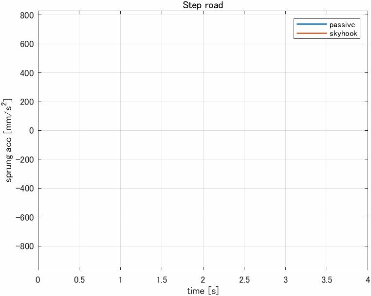
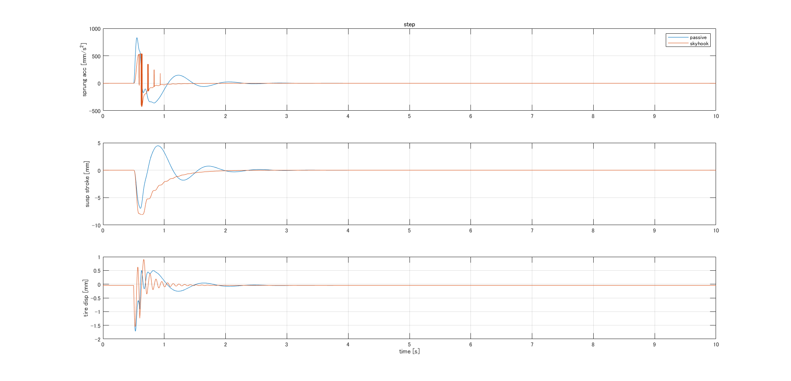
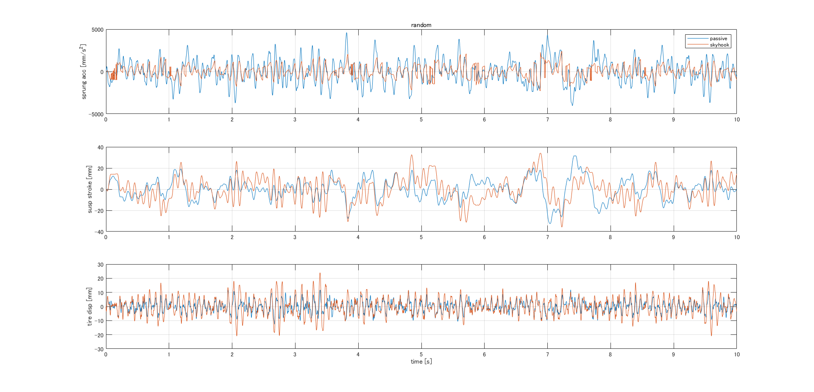
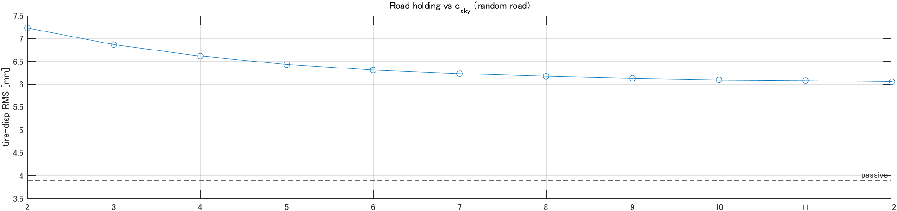

# Quarter-Car Active Suspension — Adams–Simulink Co-Simulation

> High-fidelity multibody quarter-car (Adams) coupled to a MATLAB/Simulink semi-active
> **skyhook** controller. Quantifies the ride-comfort vs road-holding trade-off of skyhook
> control against a passive suspension, on random and step roads.


<!-- TODO: short animation of passive vs skyhook over a bump -->

## What this is

The quarter-car plant (sprung mass, unsprung mass, suspension, PAC2002 tire) is built in
MSC Adams and exported with Adams/Controls as a co-simulation plant. Simulink runs the
controller and exchanges signals with the Adams Solver every communication interval. The
same model is switched between **passive** and **semi-active skyhook** control, and between
a **step** and a **random (ISO 8608)** road, so all four cases run from one script.

**Skills demonstrated:** multibody dynamics (Adams), Adams–Simulink co-simulation,
semi-active control (skyhook), MATLAB scripting & signal processing, and — most importantly —
interpreting the comfort vs road-holding trade-off from the results.

## Results

RMS metrics over a 10 s run (signals are in MMKS: mm, mm/s²):

| metric                              | step&nbsp;passive | step&nbsp;skyhook | random&nbsp;passive | random&nbsp;skyhook |
|-------------------------------------|------:|------:|--------:|--------:|
| comfort — sprung accel RMS [mm/s²]  | 86.6 | 53.6 | 1388.7 | 719.5 |
| road holding — tire-defl RMS [mm]   | 0.145 | 0.120 | 3.89 | 6.20 |
| stroke — susp-defl RMS [mm]         | 0.95 | 1.19 | 10.03 | 11.49 |

Skyhook lowered the RMS sprung-mass acceleration (comfort) by ~38% on the step road and
~48% on the random road. On the step road road-holding also improved slightly; on the
**random road, road-holding was worse than passive** — a trade-off discussed below.
Suspension stroke increased modestly, as expected for an actively worked suspension.




## Discussion — why road-holding degrades on the random road

An ideal skyhook law commands **zero force** whenever the damper cannot dissipate in the
required direction (the "off" quadrant, where `sprung_vel · susp_vel ≤ 0`). During those
intervals the unsprung mass is left essentially undamped, which raises the dynamic tire
load in the wheel-hop band. A passive damper, by contrast, provides damping at all times,
so it holds the road better in this respect.

A sweep of the skyhook coefficient `cs_s` confirmed the effect is **monotonic and
structural** — road-holding improves as `cs_s` increases but never reaches the passive
level — which is consistent with this mechanism rather than an implementation error.



A semi-active implementation that keeps a small minimum off-state damping (`cs_s_min`) would
mitigate this; it is listed under future work.

## How it works

```
 road input            control force (skyhook)
     |                          ^
     v                          |
 +----------------+   y   +-------------------+
 |  Adams         | ----> |  Simulink         |
 |  plant         |       |  skyhook / passive|
 | (Adams Solver) | <---- |                   |
 +----------------+   u   +-------------------+
   Adams/Controls           adams_sub S-Function
   (co-simulation)          (Adams Solver runs in its own process, separate from Simulink)
```

Two base-workspace switches select the case:

- `use_skyhook` : 0 = passive, 1 = skyhook
- `use_random`  : 0 = step road, 1 = random road

## Repository structure

```
.
├── adams/                  # Adams quarter-car model + Adams/Controls export
├── simulink/               # co-simulation model (.slx)
├── matlab/                 # init.m (setup), postprocess.m (metrics & plots), sweep_cs_s.m
├── results/                # figures and demo animation
└── docs/                   # engineering notes
```

## How to run

1. **Run `matlab/postprocess.m`.** Runs all four cases (2 roads × passive/skyhook),
   prints the metric tables, and plots the comparisons.
2. *(optional)* **Run `matlab/sweep_cs_s.m`** to trace road holding and comfort against the
   skyhook coefficient.

## Design notes

- **Controller:** semi-active skyhook, `F = -cs_s · sprung_acc`, clipped to the dissipative
  quadrant (a real damper can only remove energy).
- **Excitation:** the road is applied at the tire–road contact (road → body), the
  physically correct input for a ride study.
- **Units:** the Adams model uses the MMKS system (mm, kg, N, s); logged signals are in
  mm and mm/s² (divide by 1000 for SI).

## Limitations & future work

- Add a minimum off-state damping (`cs_s_min`) to the semi-active law to recover road holding
  on broadband roads.
- Smooth the semi-active switching to remove the acceleration spikes at damper on/off.
- Extend to a full-vehicle model (Adams/Car); add a braking / cornering scenario.
- Add Python automation for parameter sweeps and sensitivity analysis.

## License

MIT — see [LICENSE](LICENSE).

## Author

`Takuma Matsuda` — multibody dynamics & CAE.  LinkedIn: `www.linkedin.com/in/takuma-matsuda`
